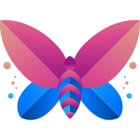

<div align="center">
  

# Glyphic

A browser based text design tool for creating typographic visuals.
<br />
Write content, customize styling, and export publication-ready images.

<p align="center">
  
  
  
  
  <a href="https://github.com/byllzz">
    
  </a>
  
  
</p>

[](https://useglyphic.vercel.app)

</div>


<!--  -->


⭐ **Star it on GitHub** if it saves you from wrestling with CSS for your next typography project.


## What is Glyphic?

Glyphic is a **browser‑based live editor** for creating custom typographic compositions. It combines a rich text toolbar, a real‑time canvas, theme management, viewport presets, and high‑resolution export - all in one clean interface.

No sign‑up, no server, no tracking. Everything runs locally in your browser. Your designs are **never uploaded**; you can download them as PNG or SVG instantly.

##  Features

**Core editing** <br/>
✔️ **Live preview canvas** - every keystroke updates the design instantly.<br/>
✔️ **Rich text toolbar** - apply bold, italic, underline, strikethrough, headings, case conversion, and font size to **selected text only**.<br/>
✔️ **25+ pre‑defined themes** - Serif, Sans, Mono, Terminal, Vintage, Modern, Code - each with background, text, and placeholder colours.<br/>
✔️ **Custom theme override** - colour pickers for background & text, random theme generator, and paper texture intensity.<br/>

**Typography & layout** <br/>
✔️ **Viewport presets** - Square (1:1), Portrait (4:5), Landscape (16:9), Mobile (9:16), Tablet (4:3), Desktop (16:10).<br/>
✔️ **Font manager** - 20+ Google Fonts, grouped by category (Serif, Sans, Mono, Handwriting, Decor).<br/>
✔️ **Advanced controls** - line height, letter spacing, word spacing, inner padding, drop cap (standard/large/huge).<br/>

**Creative extras** <br/>
✔️ **Kaomoji library** - 😊, ❤️, ✨, etc. - click to insert at cursor.<br/>
✔️ **Decorations** - dividers, bullets, stars, hearts, arrows, musical notes.<br/>
✔️ **Paper texture** - grain + noise overlay (0-100%).<br/>

**Export & sharing** <br/>
✔️ **PNG export** - 2x, 3x, 4x scaling (up to 4320×4320).<br/>
✔️ **SVG export** - raw vector format.<br/>
✔️ **Theme override** - temporarily change colours inside the export modal without affecting the main canvas.<br/>

**UX & accessibility** <br/>
✔️ **Responsive layout** - two columns on desktop; mobile switches editor/preview with tabs while controls stay visible.<br/>
✔️ **Keyboard shortcuts** - Ctrl+B (bold), Ctrl+I (italic), Ctrl+U (underline).<br/>
✔️ **Click‑outside to close** - all dropdowns and modals close when you click away.<br/>

---

## Usage

1. **Enter text** – type or paste into the left panel. Select any portion to format it.
2. **Format with the toolbar** – make text bold, italic, underlined, or add headings, lists, and case changes.
3. **Pick a theme** – click **Themes** to open the gallery and choose a preset.
4. **Custom colours & texture** – open **Theme Colors** to pick any background/text colour, add paper texture, or generate a random palette.
5. **Set the canvas size** – use the **ViewPorts** dropdown to match a device or aspect ratio.
6. **Fine‑tune typography** – adjust font size, line height, letter/word spacing, padding, and drop cap.
7. **Add Kaomoji or decorations** – click **Kaomoji** or **Decor** to insert symbols at the cursor position.
8. **Export** – press **Export**, choose quality and format, optionally override the theme, and download your design.

---

##  Block Reference (Components)

| Component           | Purpose                                                                 |
|---------------------|-------------------------------------------------------------------------|
| `Canvas`            | Renders the live preview with background, text colour, texture, drop cap, and applied HTML formatting. |
| `TextToolbar`       | Rich text formatting on selected text (bold, italic, underline, strikethrough, case, headings, lists). |
| `Themes`            | Modal with searchable theme gallery. Applies a complete theme.          |
| `ThemeColors`       | Colour pickers, random theme, texture slider. Overrides the current theme. |
| `ViewPorts`         | Dropdown for canvas dimensions (Square, Portrait, Mobile, etc.).        |
| `FontSelector`      | Dropdown to choose from 20+ fonts (grouped by category).                |
| `FontSize`          | Presets + custom input for font size (applies to selected text).        |
| `LineHeight`        | Slider and presets for line height.                                     |
| `DropCap`           | Enables/disables drop cap and chooses size.                             |
| `Padding`           | Slider and presets for inner canvas padding.                            |
| `KaomojiSelector`   | Categorized grid of emoticons that insert at cursor.                    |
| `Decorations`       | Grid of decorative symbols (dividers, bullets, stars, hearts, arrows).  |
| `ExportOptions`     | Modal for quality, format, theme override, and download. Uses `html‑to‑image`. |
| `Navbar`            | Top bar containing logo, viewport selector, themes button, and export.   |

---

## Project Structure

```
glyphic/
├── public/
│ └── favicon.svg
├── src/
│ ├── components/
│ │ ├── Canvas.jsx
│ │ ├── CanvasControls.jsx
│ │ ├── Decorations.jsx
│ │ ├── DropCap.jsx
│ │ ├── ExportOptions.jsx
│ │ ├── FontSelector.jsx
│ │ ├── FontSize.jsx
│ │ ├── InputArea.jsx
│ │ ├── KaomojiSelector.jsx
│ │ ├── LineHeight.jsx
│ │ ├── Logo.jsx
│ │ ├── Navbar.jsx
│ │ ├── Padding.jsx
│ │ ├── TextFormatting.jsx
│ │ ├── TextToolbar.jsx
│ │ ├── ThemeColors.jsx
│ │ ├── ThemeOverride.jsx
│ │ ├── Themes.jsx
│ │ └── ViewPorts.jsx
│ ├── data/
│ │ ├── fonts.js
│ │ └── themes.js
│ ├── App.jsx
│ ├── main.jsx
│ └── index.css
├── index.html
├── package.json
├── vite.config.js
├── tailwind.config.js
└── README.md
```


---

##  Tech Stack

- [**React**](https://react.dev/) + [**Vite**](https://vitejs.dev/) – component architecture and build tooling
- [**Tailwind CSS**](https://tailwindcss.com/) – utility‑first styling, dark/light theme support
- [**html‑to‑image**](https://github.com/bubkoo/html-to-image) – DOM to PNG/SVG export
- [**React Icons**](https://react-icons.github.io/react-icons/) – icon set (Feather, FontAwesome, etc.)
- [**Vercel**](https://vercel.com) – deployment and hosting

---

##  Getting Started

```bash
# clone the repo
git clone https://github.com/your-username/glyphic.git
cd glyphic

# install dependencies
npm install

# run locally
npm run dev

# build for production
npm run build
```


## Contributing

Got a better excuse? Found a tone that's missing? Open a PR.

```bash
# 1. fork the repo
# 2. create your branch
git checkout -b feat/your-feature

# 3. make your changes
# 4. commit
git commit -m "feat: add your feature"

# 5. push and open a PR
git push origin feat/your-feature
```

**Ways to contribute:**

- Add new theme presets (src/data/themes.js).
- Add new fonts (src/data/fonts.js).
- Improve the rich text toolbar (e.g., support for inline code,  blockquotes).
- Enhance the export options (e.g., more formats, custom dimensions).
- Fix bugs or improve accessibility.


##  Pull Request Guidelines

- Keep PRs focused - one feature or one fix per PR.
- If you're unsure whether something fits the project scope, open an issue first for discussion.

---

# License

This project is licensed under the MIT License - see the [LICENSE.md](./LICENSE) file for details.
