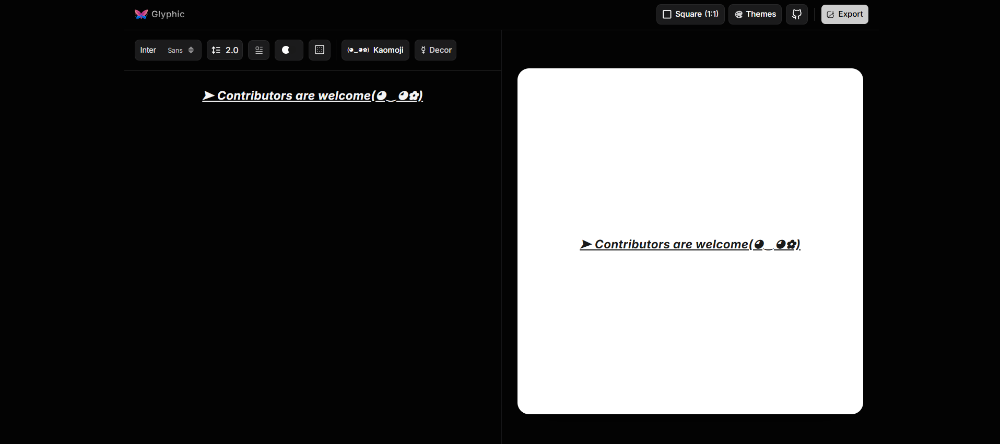

# <a href="https://useglyphic.vercel.app" target="_blank">Glyphic - A browser-based text design tool.</a>

Glyphic gives you a typography-first workspace: write content, style selected text, apply curated themes, adjust spacing, and export high-resolution images. Everything runs in your browser. Your content never leaves your device.

<p align="left">
  <a href="./LICENSE">
    
  </a>
  
  
  <a href="https://github.com/byllzz">
    
  </a>
<a href="https://github.com/byllzz/glyphic/releases">
  
</a>
</p>

[](https://useglyphic.vercel.app)

<p align="start">
  
  :star: Star me on GitHub — it helps!
</p>

## Why Glyphic?

- **Traditional design tools** → Too heavy for typography-only tasks.
- **Social media tools** → Require accounts and offer limited customization.

Glyphic bridges the gap: focused, real-time, local-first, and zero setup.

---

## Highlights

| Feature | Description |
|----------|-------------|
| Real-time editing | Instant canvas updates |
| 25+ themes | Curated typography themes |
| 20+ fonts | Serif, sans, mono, handwriting |
| Responsive viewports | Social, desktop, and mobile |
| Theme overrides | Fully customizable colors |
| PNG / SVG export | High-resolution and vector output |
| Privacy first | No uploads, no accounts |

---

## Features

### Core Editing

- Live canvas preview
- Rich text toolbar
  - Bold
  - Italic
  - Underline
  - Strikethrough
  - Headings
  - Lists
  - Case transforms
  - Font sizing
- Formatting applies **only to selected text**

### Typography Controls

- 20+ Google Fonts
- Line height
- Letter spacing
- Word spacing
- Internal padding
- Drop caps
  - Standard
  - Large
  - Huge

### Theme System

- 25+ presets
  - Serif
  - Sans
  - Mono
  - Terminal
  - Vintage
  - Code
  - Editorial
  - More...
- Full color overrides
  - Background
  - Text
  - Texture intensity

### Creative Tools

- Kaomoji library for quick insertion:
  (｡◕‿◕｡)

* Decorative elements:

  * Dividers
  * Bullets
  * Stars
  * Hearts
  * Arrows
  * Notes
* Paper texture control:

  * 0% = clean
  * 100% = heavy grain + noise

### Export System

* **PNG**

  * 2× scale
  * 3× scale
  * 4× scale
  * Up to 4320 × 4320
* **SVG**

  * Vector export
  * Print-ready
  * Editable in design software
* Export-time theme overrides independent from editor canvas

### Accessibility & UX

* Responsive layout

  * Desktop split view
  * Mobile tab navigation
* Keyboard shortcuts

| Shortcut   | Action    |
| ---------- | --------- |
| `Ctrl + B` | Bold      |
| `Ctrl + I` | Italic    |
| `Ctrl + U` | Underline |

* Click outside modals to close
* Consistent interaction patterns

---

## Architecture

```text
User Input
    │
    ▼
Text Toolbar
    │
    ▼
Formatting Engine
    │
    ▼
Canvas Renderer
    │
    ▼
Theme System
    │
    ▼
Export Module
    │
    ▼
PNG / SVG Output
```

### Layers

* **Canvas Layer**

  * Rendering
  * Themes
  * Typography
  * Textures
  * Viewports

* **Theme Layer**

  * Presets
  * Overrides
  * Random generation
  * Color management

* **Export Layer**

  * `html-to-image`
  * PNG export
  * SVG export
  * Scaling
  * Color overrides

---

## Component Reference

| Component         | Responsibility       |
| ----------------- | -------------------- |
| `Canvas`          | Typography rendering |
| `TextToolbar`     | Formatting actions   |
| `Themes`          | Theme gallery        |
| `ThemeColors`     | Custom color picker  |
| `ViewPorts`       | Canvas dimensions    |
| `FontSelector`    | Font selection       |
| `FontSize`        | Font sizing          |
| `LineHeight`      | Line spacing         |
| `Padding`         | Internal spacing     |
| `DropCap`         | Editorial styling    |
| `KaomojiSelector` | Kaomoji insertion    |
| `Decorations`     | Decorative elements  |
| `ExportOptions`   | Export pipeline      |
| `Navbar`          | Global actions       |

---

## Getting Started

### Clone the Repository

```bash
git clone https://github.com/your-username/glyphic.git
cd glyphic
```

### Install Dependencies

```bash
npm install
```

### Start Development Server

```bash
npm run dev
```

---

## Scripts

| Command           | Description                      |
| ----------------- | -------------------------------- |
| `npm run dev`     | Start development server         |
| `npm run build`   | Create production build          |
| `npm run preview` | Preview production build locally |

---

---

## Contributing

Contributions are welcome, including:

* Bug fixes
* New themes
* Additional fonts
* Accessibility improvements
* Feature enhancements

### Areas to Improve

#### Themes

```text
src/data/themes.js
```

#### Fonts

```text
src/data/fonts.js
```

#### Accessibility

* Keyboard navigation
* Screen reader support
* Focus management

#### Export

* Custom dimensions
* PDF support
* Batch exports

#### Mobile

* Touch interactions
* Layout refinements

---

## Development Workflow

### 1. Fork & Clone

```bash
git clone <your-fork>
```

### 2. Create a Branch

```bash
git checkout -b feat/my-feature
```

### 3. Develop & Test

```bash
npm run dev
npm run build
```

### 4. Commit Changes

Use Conventional Commits:

```text
feat:
fix:
docs:
refactor:
```

### 5. Open a Pull Request

Include:

* Description
* Screenshots (if UI changed)
* Testing notes

---

## Pull Request Checklist

* [ ] No console errors
* [ ] Existing functionality remains intact
* [ ] Documentation updated
* [ ] Screenshots included for UI changes

---

## Roadmap

* Custom canvas dimensions
* User-created themes
* Theme import/export
* Undo / Redo
* Text shadows
* Gradient backgrounds
* Template library
* Keyboard shortcuts guide

---

## Privacy

* No accounts
* No tracking
* No analytics
* No content uploads
* Everything stays on your device
* Exports generated locally

---

## License

MIT © Bilal Malik

This project is licensed under the MIT License - see the [LICENSE.md](./LICENSE) file for details.

